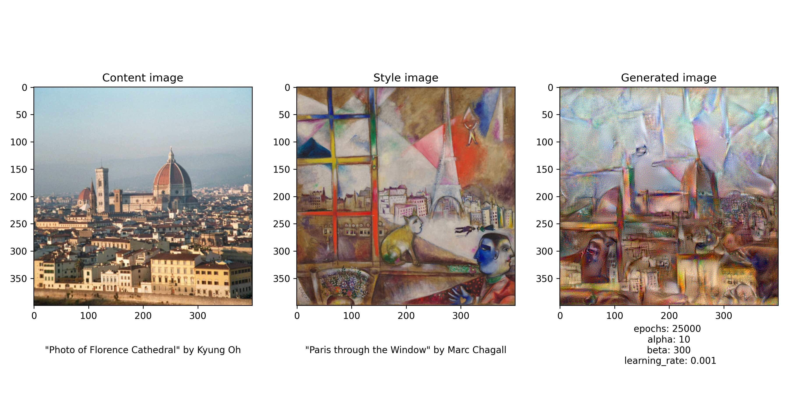
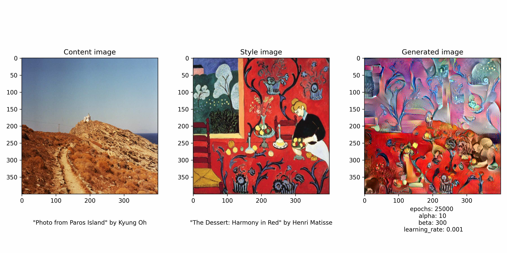

## Art Generation -- Neural Style Transfer

### Navigating the files and directories

- You can find a step-by-step walkthrough of the project in the file **nst_style_transfer_walkthrough.ipynb**. All the helper functions are included in the notebook to help the reader more easily follow the steps. 

- You can find a tidier version of the code in **nst_style_transfer_production.ipynb**. Everything is contained in a single function that you can try running to generate your own image. I moved all helper functions to the separate python file **nst_helper_functions.py**. 

- **Scroll below** to see some of my generated images.

### Overview of the project

- The goal is to generate an image (**G**) by merging a "content" image (**C**) with a "style" image (**S**). The generated image will contain the content of C in the style of S. 

- I use a previously trained convolutional network to capture, or encode, the content of "C" and the style of "S". Specifically, I use the VGG19 model trained on the ImageNet database. 

- You can see some of my generated images in the directory **generated_images**.

- Below, I wrote a high-level introduction of the ideas behind this project. 

### 1) VGG19 architecture overview
- The VGG19 model consists of five convolutional blocks followed by three fully connected layers. The model contains 19 layers in total. For the full details see the original paper [here](https://arxiv.org/abs/1508.06576).

### 2) Optimization objective: Defining the cost function

We essentially want to minimise the "difference" between the content of G and the content of C, as well as the difference between the style of G and the style of S. 

Our loss function is therefore: 

J_total = alpha * J_content + beta * J_style

where J_content is the content cost function, representing the "difference" between the content of G and the content of C, and J_style is the style cost function, representing the "difference" between the style of G and the style of C. 

The coefficients "alpha" and "beta" can be adapted depending on whether we prioritise G's similarity with the content of C or the style of S. 

#### 2.1) Content cost function (J_content)

- We choose a hidden layer of the VGG19 model with which to encode the content of C and G. 
- For this project, I chose the layer 'block5_conv4'
- Forward propagate image "C" and let **a_C** be the activations of the chosen hidden layer. The tensor a_C has the dimensions (n_H, n_W, n_C) and represents the "content" of image "C". 
- Forward propagate image "G" and let **a_G** be the activations of the chosen hidden layer. The tensor a_G has the dimensions (n_H, n_W, n_C) and represents the "content" of image "G".
- Compute J_content based on the squared L2 norm of (a_C - a_G). 

#### 2.2) Style cost function (J_style)

- Before we define the style cost function, we first need to discuss what we mean by the "style" of an image. 

##### 2.2.1) The "style" matrix (Gram matrix)
- Say we forward propagate the image "S" through the VGG model to obtain a_S, the activations of one of the hidden layers. 
- Each channel of a_S detects a particular feature of the image "S". 
- We conceptualise the "style" of the image as the "correlation" between the activations across the different channels.
- For example, if one channel detects vertical stripes, and another channel detects the colour orange, we want to know if these two features are (or are not) correlated with each other in the image. This degree of correlation between select features is how we understand the "style" of the image. 
- If the features are correlated in the image "S", we want them to be correlated in the image "G" as well. 
- The "Gram matrix" measures this degree of correlation.
- By "correlation", what we mean is the "unnormalised cross-variance". 

##### 2.2.2) Computing the style cost function 
- We choose a number of hidden layers of the VGG19 model with which to encode the style of "S" and "G".
- For this project, I chose the layers 'block1_conv1', 'block2_conv1', 'block3_conv1', 'block4_conv1', 'block5_conv1'.
- Forward propagate image "S" to obtain an a_S tensor for each layer. The a_S tensor has the dimensions (n_H, n_W, n_C).
- Forward propagate image "G" to obtain an a_G tensor for each layer. The a_G tensor has the dimensions (n_H, n_W, n_C).
- For each layer, compute the Gram matrix for a_S and a_G. 
- For each layer, compute the layer style cost based on the squared L2 norm of the difference between the Gram matrices. 
- Compute the sum of all layer style costs to obtain the total style cost.

#### 2.3) Remark on the optimization process
- Note: normally when we work with neural networks, we are optimizing the weights of a model. In contrast, here we are optimizing the actual **pixels** of our generated image. 

#### 2.4) Remark on initializing the generated image (G)
- We initialise the generated image as a "noisy" version of the content image. Essentially we create a copy of the image "C" and add random pixels to introduce noise. The addition of noise enables the image G to more quickly match the style of image S.

### 3) Some images I generated

